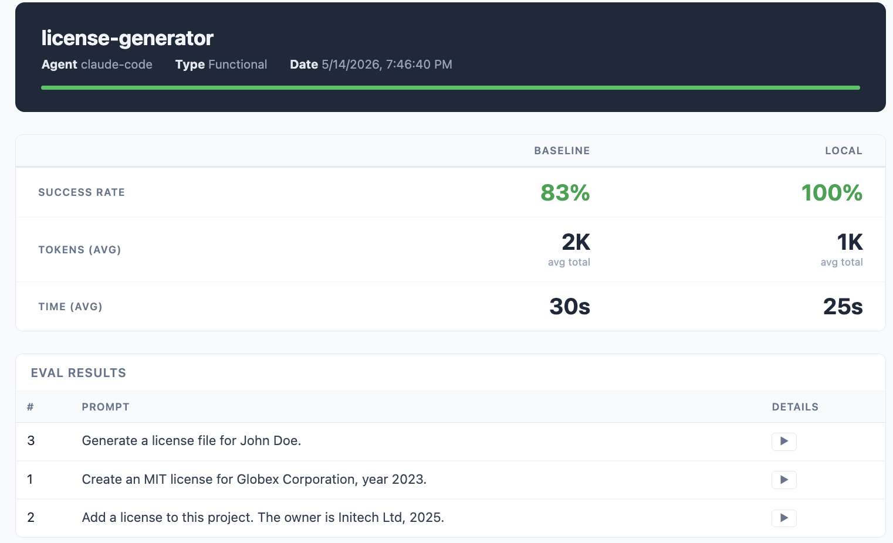

# skill-eval

A CLI tool for evaluating Agent Skills locally. Tests whether your skill triggers reliably and produces the right output, using an LLM as the judge.

## What you can test

skill-eval ships two commands, each targeting a different failure mode:

- **Triggering** (`skill-eval trigger`) — checks whether the agent actually decides to invoke the skill in the right context. A skill that never gets triggered cannot help, no matter how good its instructions are.
- **Functional correctness** (`skill-eval functional`) — checks whether the actions the agent takes while the skill is active match your expectations. An LLM judge grades each transcript against the expectation list you provide.

## Why run skill evals

- **Avoid regression** — it is very common that, while iterating to make a skill handle a new case, it stops solving cases it used to handle. Evals make every iteration measurable, so you can tell whether a change adds value without silently subtracting it elsewhere.
- **Validate against a baseline** — sometimes an agent solves a task better using its general capabilities than using a specific skill (and even if it works today, model upgrades can shift that balance). Comparing against the no-skill baseline (`--compare-baseline`) or past skill versions (`--compare-ref`) tells you whether the skill is really pulling its weight.
- **Statistical confidence** — LLMs are non-deterministic, so a single passing run is not evidence. Running the same expectations N times produces a pass rate (pass@k) that turns "it feels like it works" into a number you can defend.

## How it works

For each eval prompt, skill-eval spins up parallel agent processes with the current skill installed by default. You can optionally add the no-skill baseline or historical skill branches for side-by-side comparison. Each agent runs headlessly and produces a transcript. An LLM judge then grades each transcript against your expectations. Results are aggregated into **pass@k** metrics, giving you a clear view of how the skill behaves in isolation or relative to comparison targets.

```
                  eval prompt
                       │
               ┌───────▼───────┐
               │   skill-eval  │
               └───────┬───────┘
                       │
           ┌───────────┴───────────┐
      ─ with skill ─        ─ baseline (opt) ─
      ┌──────┴──────┐         ┌─────┴──────┐
    agent 1      agent 2   agent 3      agent 4
      │              │         │             │
    judge          judge     judge         judge
      └──────┬──────┘         └──────┬──────┘
             └──────────┬────────────┘
                        │
                     pass@k
```

> The `trigger` command only runs with-skill trials and checks whether the skill dispatch tool was actually invoked — no judge or baseline needed.
>
> The baseline branch is opt-in: enable it with `--compare-baseline` (no-skill control) or `--compare-ref <ref>` (historical skill versions).

## Installation

**Requirements:** Node.js, and the agent CLI you want to evaluate (e.g. `gemini`, `codex`, or `claude`) installed and on `$PATH`.

### Run without installing

```sh
npx @fede0089/skill-eval --help
```

### Install globally

```sh
npm install -g @fede0089/skill-eval
skill-eval --help
```

### From source

```sh
git clone https://github.com/fede0089/skill-eval.git
cd skill-eval
npm install
npm run build
npm link        # makes `skill-eval` available globally
```

## Commands

```sh
# Checks that the skill is triggered (invoked) for each prompt
skill-eval trigger --workspace <path> --skill <path> [options] [agent]

# Checks that the skill produces correct output (skill-only by default)
skill-eval functional --workspace <path> --skill <path> [options] [agent]
```

### Options

| Flag | Required | Default | Description |
|------|----------|---------|-------------|
| `--workspace <path>` | yes | — | Path to the repo the agent will run in |
| `--skill <path>` | yes | — | Path to the skill directory |
| `--agents <number>` | no | `4` | Number of parallel agent processes |
| `--trials <number>` | no | `3` | Trials per task (for pass@k) |
| `--timeout <seconds>` | no | none | Kill the agent after this many seconds |
| `--eval-id <id>` | no | all | Run only the eval with this numeric ID |
| `--compare-ref [refs...]` | no | — | Git references to compare against |
| `--compare-baseline` | no | `false` | Also run the no-skill baseline alongside the skill |
| `-v, --debug` | no | `false` | Enable verbose debug logging |
| `[agent]` | no | `gemini-cli` | Agent backend to use |

Supported runners:

- `gemini-cli` (default)
- `codex`
- `claude-code`

### Skill directory structure

```
my-skill/
├── SKILL.md                        # skill definition (required)
└── evals/                          # evaluation suite (required)
    ├── my-evals.json               # one or more eval files (*.json)
    └── config/                     # runner configuration (optional but often needed)
        ├── gemini-cli/             # copied to <worktree>/.gemini/ before each trial
        │   └── settings.json
        ├── codex/                  # copied to <worktree>/.codex/ before each trial
        │   └── config.toml
        └── claude-code/            # copied to <worktree>/.claude/ before each trial
            └── settings.json
```

All `.json` files in `evals/` are loaded and merged into a single suite — you can split them by feature or regression category.

**Trigger eval** — `id` must be a unique integer across all eval files:
```json
{
  "skill_name": "my-skill",
  "evals": [
    { "id": 1, "prompt": "Do the thing that my skill handles" }
  ]
}
```

**Functional eval** — add `expectations` for the LLM judge to evaluate:
```json
{
  "skill_name": "my-skill",
  "evals": [
    {
      "id": 1,
      "prompt": "Create a file called hello.txt containing the word 'world'",
      "expectations": [
        "A file named hello.txt was created",
        "The file contains the text 'world'"
      ]
    }
  ]
}
```

## Permissions

**This is the most common cause of eval failures.**

skill-eval runs the agent headlessly — stdin is closed, there is no terminal. If the agent encounters a tool that requires interactive approval, it will either fail immediately or hang until the trial timeout kills it.

Each runner configures its own non-interactive mode. For example, Gemini CLI uses `--approval-mode auto_edit`, Codex uses `codex exec --json --sandbox workspace-write -c approval_policy="never"`, and Claude Code uses `claude -p --output-format stream-json --permission-mode bypassPermissions`. If your skill needs to run shell commands, read environment variables, make network calls, or use any other tool category, refer to that runner's permission model.

**Solution:** place a config file inside your skill at `evals/config/<runner>/`. Before every trial, skill-eval automatically copies that directory into the agent's config location inside the isolated worktree:

```
evals/config/gemini-cli/   →  <worktree>/.gemini/
evals/config/codex/        →  <worktree>/.codex/
evals/config/claude-code/  →  <worktree>/.claude/
```

Use this to ship both settings and policies alongside your evals. Anything inside `evals/config/<runner>/` is dropped verbatim into the runner's config directory, so you can use the runner's full configuration surface — not just `settings.json`.

### Gemini CLI example

Gemini CLI reads both `settings.json` and any `*.toml` rule files under `policies/`. Drop them inside `evals/config/gemini-cli/` and skill-eval will copy them into `<worktree>/.gemini/` before each trial:

```
my-skill/
└── evals/
    └── config/
        └── gemini-cli/
            ├── settings.json
            └── policies/
                ├── allow-activate-skill.toml
                └── allow-tools.toml
```

`settings.json` holds general configuration (telemetry, model, etc.):

```json
{
  "telemetry": { "enabled": false }
}
```

Policies whitelist specific tools so they run without prompting. For example, to always allow the `activate_skill` dispatch tool in non-interactive mode:

```toml
# evals/config/gemini-cli/policies/allow-activate-skill.toml
[[rule]]
toolName    = "activate_skill"
decision    = "allow"
priority    = 100
interactive = false
```

Refer to your runner's documentation for the full set of settings and policy keys (Codex uses `config.toml`, Claude Code uses `settings.json`).

> This config only applies inside the temporary worktree created for each trial. Your real workspace config is never touched.

## Reports

Each run writes to `.project-skill-evals/runs/<timestamp>/` and includes per-trial logs, the raw eval JSON, and a self-contained HTML report you can open in any browser. The report shows pass@k aggregates per eval, lets you expand each trial, and color-codes triggering vs. functional outcomes.

A published sample report is available at [fede0089.github.io/skill-eval/sample-report.html](https://fede0089.github.io/skill-eval/sample-report.html),generated from this project root with:

```sh
skill-eval functional --workspace . --skill mock-skill --trials 2 --compare-baseline --debug claude-code
```



### Debug logs

When a trial misbehaves, pass `-v` / `--debug` to capture the full transcripts to disk. Each trial writes a `task_<id>_<variant>_trial_<n>.log` file inside the run directory with two sections appended in order:

- `# SECTION: <MODE> AGENT RUN` — the initial prompt sent to the agent and its raw streamed response.
- `# SECTION: <MODE> JUDGE RUN` — the prompt sent to the LLM judge and its verdict (only present for `functional` runs; `trigger` is graded programmatically and produces no judge section).

Without `--debug` these files are not written, so reach for the flag when you need to see exactly what the agent — or the judge — saw.

## Try it out

This repo includes a `mock-skill/` directory — a complete, working example of a license-generator skill with trigger and functional evals. Run it directly with:

```sh
npm run test:unit        # run the unit test suite
npm run test:trigger     # trigger evaluation against mock-skill
npm run test:functional  # functional evaluation against mock-skill
npm run test:trigger -- codex            # run trigger evals with Codex
npm run test:functional -- codex         # run functional evals with Codex
npm run test:trigger -- claude-code      # run trigger evals with Claude Code
npm run test:functional -- claude-code   # run functional evals with Claude Code
```

## Extending

### Adding a new agent runner

1. Create `src/runners/<your-agent>/runner.ts` implementing the `AgentRunner` interface (see `src/runners/runner.interface.ts`).
2. Export it from `src/runners/<your-agent>/index.ts`.
3. Register it in `src/runners/registry.ts`:
   ```ts
   '<your-agent>': { Runner: YourRunner, binary: '<cli-binary-name>' },
   ```

The factory, preflight check, and CLI all pick it up automatically.

> Implement `applyRunnerConfig(evalConfigBaseDir, worktreePath)` to copy `evalConfigBaseDir/<your-agent>/` into the appropriate config directory in the worktree (e.g. `.claude/` for a Claude runner). No-op silently if the directory doesn't exist.

### Adding a new report format

1. Create `src/reporters/<format>-reporter.ts` implementing `Reporter`.
2. Add a case for it in `createReporter()` in `src/reporters/index.ts`.
