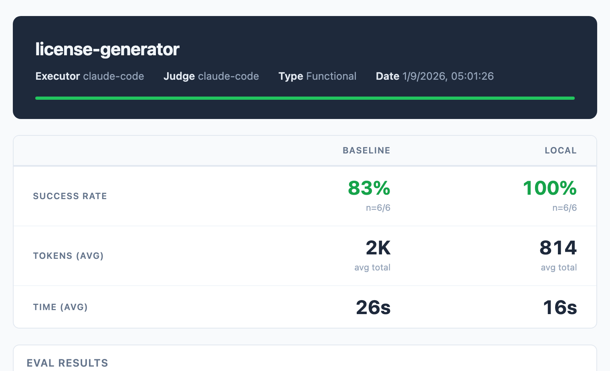

# skill-eval

A CLI tool for evaluating Agent Skills locally. Tests whether your skill triggers reliably and produces the right output, using an LLM as the judge.

## What you can test

skill-eval ships two commands, each targeting a different failure mode:

- **Triggering** (`skill-eval trigger`) — checks whether the agent actually decides to invoke the skill in the right context, and leaves it alone in the wrong one. A skill that never gets triggered cannot help, no matter how good its instructions are; one that triggers everywhere gets in the way.
- **Functional correctness** (`skill-eval functional`) — checks whether the actions the agent takes while the skill is active match your expectations. An LLM judge grades each transcript against the expectation list you provide.

## Why run skill evals

- **Avoid regression** — it is very common that, while iterating to make a skill handle a new case, it stops solving cases it used to handle. Evals make every iteration measurable, so you can tell whether a change adds value without silently subtracting it elsewhere.
- **Validate against a baseline** — sometimes an agent solves a task better using its general capabilities than using a specific skill (and even if it works today, model upgrades can shift that balance). Comparing against the no-skill baseline (`--compare-baseline`) or past skill versions (`--compare-ref`) tells you whether the skill is really pulling its weight.
- **Statistical confidence** — LLMs are non-deterministic, so a single passing run is not evidence. Running the same expectations N times produces a pass rate (pass@k) that turns "it feels like it works" into a number you can defend.

## How it works

For each eval prompt, skill-eval spins up parallel agent processes with the current skill installed by default. You can optionally add the no-skill baseline or historical skill branches for side-by-side comparison. Each agent runs headlessly and produces a transcript. An LLM judge then grades each transcript against your expectations. Results are aggregated into **pass@k** metrics, giving you a clear view of how the skill behaves in isolation or relative to comparison targets.

```
                  eval prompt
                       │
               ┌───────▼───────┐
               │   skill-eval  │
               └───────┬───────┘
                       │
           ┌───────────┴───────────┐
      ─ with skill ─        ─ baseline (opt) ─
      ┌──────┴──────┐         ┌─────┴──────┐
    agent 1      agent 2   agent 3      agent 4
      │              │         │             │
    judge          judge     judge         judge
      └──────┬──────┘         └──────┬──────┘
             └──────────┬────────────┘
                        │
                     pass@k
```

> The `trigger` command only runs with-skill trials and checks whether the skill dispatch tool was actually invoked — no judge or baseline needed. Evals marked `should_trigger: false` assert the opposite: that it was *not* invoked.
>
> The baseline branch is opt-in: enable it with `--compare-baseline` (no-skill control) or `--compare-ref <ref>` (historical skill versions).
>
> Each `--compare-ref` version is extracted under the artifacts root, outside the workspace, and removed when the run ends. Every variant's trials are still cut from the workspace repository — the extracted copy contributes only the skill implementation.
>
> The evals are frozen at the start of the run, and every variant is measured with them: a historical version brings its implementation and nothing else, never its own evals or evaluation config. That is what makes the numbers comparable when the evals themselves changed between the two versions.

## Installation

**Requirements:** Node.js, and the agent CLI you want to evaluate (e.g. `gemini`, `codex`, or `claude`) installed and on `$PATH`.

### Run without installing

```sh
npx @fede0089/skill-eval --help
```

### Install globally

```sh
npm install -g @fede0089/skill-eval
skill-eval --help
```

### From source

```sh
git clone https://github.com/fede0089/skill-eval.git
cd skill-eval
npm install
npm run build
npm link        # makes `skill-eval` available globally
```

## Commands

```sh
# Checks that the skill is triggered (invoked) for each prompt
skill-eval trigger --workspace <path> --skill <path> [options]

# Checks that the skill produces correct output (skill-only by default)
skill-eval functional --workspace <path> --skill <path> [options]

# Measures the skill as it stands against its committed version, and keeps what measures better
skill-eval evolve --workspace <path> --skill <path> [options]
```

### Options

| Flag | Required | Default | Description |
|------|----------|---------|-------------|
| `--workspace <path>` | yes | — | Path to the repo the agent will run in |
| `--skill <path>` | yes | — | Path to the skill directory |
| `--agents <number>` | no | `4` | Number of parallel agent processes |
| `--trials <number>` | no | `5` | Trials per task (for pass@k) |
| `--timeout <seconds>` | no | none | Kill the agent after this many seconds |
| `--eval-id <id>` | no | all | Run only the eval with this numeric ID |
| `--eval-file <name>` | no | all | Run only the evals from this file in `evals/` (e.g. `edge-cases.json`) |
| `--compare-ref [refs...]` | no | — | Git references to compare against (variadic — keep it last, or follow it with another flag) |
| `--compare-baseline` | no | `false` | Also run the no-skill baseline alongside the skill |
| `--output <path>` | no | `~/.skill-eval` | Root for everything the run writes; must resolve outside the workspace and the skill |
| `-v, --debug` | no | `false` | Print verbose logs to the console (trial transcripts are always saved) |
| `--executor-agent <name>` | no | `gemini-cli` | Agent that runs the evaluated task |
| `--judge-agent <name>` | no | the executor agent | Agent that grades the result (`functional` and `evolve`) |
| `--predict <items...>` | on a dirty tree | — | Expectations an uncommitted change should improve, as `<evalId>#<n>` (`evolve` only) |

The two roles are chosen separately, so you can have one backend solve the task
and another grade it:

```sh
skill-eval functional --workspace . --skill ./my-skill \
  --executor-agent gemini-cli --judge-agent claude-code
```

`trigger` takes no `--judge-agent`: it decides whether the skill was activated by
reading the transcript, so no agent judges anything there.

Supported runners:

- `gemini-cli` (default)
- `codex`
- `claude-code`

### Evolution sessions

`evolve` turns the edit-measure-decide loop into one command. It freezes the
skill's evals for the whole session, measures the implementation you have in
your working tree against the version you have committed — both under those
frozen evals, so the only difference between them is the implementation — and
keeps the candidate only when the evidence backs it.

```sh
# you have been editing my-skill/SKILL.md and have not committed it
skill-eval evolve --workspace . --skill ./my-skill --predict 1#3
```

A candidate is accepted only when three things hold at once:

1. its aggregate effectiveness beats the committed version — equal is not better;
2. every expectation you declared with `--predict` actually improved;
3. no expectation the committed version passed in **all** its trials fails in
   **all** of the candidate's.

The second condition is why `--predict` exists. With a handful of trials and
non-deterministic agents, the same skill untouched measures differently between
runs, so accepting on the aggregate alone accepts chance. Declaring what your
change should fix turns the comparison into a test of that claim: an aggregate
that improves somewhere you did not predict is rejected as an unattributable
improvement.

`--predict` names expectations by position, `<evalId>#<n>` — eval `1`,
expectation `3`. Run the session without it on a dirty tree and it stops before
measuring anything, printing every frozen expectation with the identifier to
use. Pass it more than once to declare several.

Accepted, the session commits **only the skill's implementation** — never the
evals, never anything else you have staged or pending — and the working tree is
left on that version. Rejected, the implementation is restored from the
committed version, and whatever you had in the tree when the session started is
kept as a recoverable patch under the session directory. Either way the session
closes with a balance, and an accepted session measures itself end to end with a
fresh comparison between the version it started on and the one it ended on.

Two things are your responsibility: **the branch** — commits land on whatever
branch you left the session running on, and nothing switches branches, pushes or
opens pull requests — and the agent configuration of your repository.

### Skill directory structure

```
my-skill/                           # ── implementation: what tells the agent how to work
├── SKILL.md                        # skill definition (required)
├── references/                     # anything else your skill ships
└── evals/                          # ── evals: what measures it (required)
    ├── my-evals.json               # one or more eval files (*.json)
    └── config/                     # runner configuration (optional but often needed)
        ├── gemini-cli/             # copied to <worktree>/.gemini/ before each trial
        │   └── settings.json
        ├── codex/                  # copied to <worktree>/.codex/ before each trial
        │   └── config.toml
        └── claude-code/            # copied to <worktree>/.claude/ before each trial
            └── settings.json
```

A skill has two parts, and the tool keeps them apart. Everything outside `evals/` is the **implementation** — what tells the agent how to work. `evals/` is what measures it — the prompts, the expectations and the evaluation config of both measuring roles.

**Only the implementation reaches a trial.** The evaluated agent gets a copy of your skill with `evals/` left out, so it cannot read the expectations it is about to be graded with. The consequence is that your `SKILL.md` must not reference anything living under `evals/` — those files never arrive.

All `.json` files in `evals/` are loaded and merged into a single suite — you can split them by feature or regression category.

Use `--eval-file <name>` to run just one of them while iterating (the `.json` extension is optional), and combine it with `--eval-id <id>` to narrow down to a single eval inside that file.

**Trigger eval** — `id` must be a unique integer across all eval files:
```json
{
  "skill_name": "my-skill",
  "evals": [
    { "id": 1, "prompt": "Do the thing that my skill handles" }
  ]
}
```

**Negative trigger eval** — add `should_trigger: false` to assert the skill must *not* fire:
```json
{
  "skill_name": "my-skill",
  "evals": [
    { "id": 2, "prompt": "Something my skill has no business handling", "should_trigger": false }
  ]
}
```

Positive evals measure **under-triggering** (the skill never fires when it should). Negative evals measure the opposite failure, **over-triggering** — the one you introduce when you widen a skill's `description` to catch more cases and silently lose precision. Both kinds live in the same suite and feed a single success rate, so a change that improves one at the expense of the other shows up immediately.

A negative eval fails if the agent *attempts* to activate the skill at all, even if the activation itself errors out. These evals are trigger-only: `skill-eval functional` skips them, since that command instructs the agent to use the skill.

> Trigger detection for Codex is heuristic (it infers activations from the event stream), so negative evals are most reliable on `claude-code` and `gemini-cli`.

**Functional eval** — add `expectations` for the LLM judge to evaluate:
```json
{
  "skill_name": "my-skill",
  "evals": [
    {
      "id": 1,
      "prompt": "Create a file called hello.txt containing the word 'world'",
      "expectations": [
        "A file named hello.txt was created",
        "The file contains the text 'world'"
      ]
    }
  ]
}
```

## Permissions

**This is the most common cause of eval failures.**

skill-eval runs the agent headlessly — stdin is closed, there is no terminal. If the agent encounters a tool that requires interactive approval, it will either fail immediately or hang until the trial timeout kills it.

Each runner configures its own non-interactive mode. For example, Gemini CLI uses `--approval-mode auto_edit`, Codex uses `codex exec --json --sandbox workspace-write -c approval_policy="never"`, and Claude Code uses `claude -p --output-format stream-json --permission-mode bypassPermissions`. If your skill needs to run shell commands, read environment variables, make network calls, or use any other tool category, refer to that runner's permission model.

**Solution:** place a config file inside your skill at `evals/config/<runner>/`. Before every trial, skill-eval automatically copies that directory into the agent's config location inside the isolated worktree:

```
evals/config/gemini-cli/   →  <worktree>/.gemini/
evals/config/codex/        →  <worktree>/.codex/
evals/config/claude-code/  →  <worktree>/.claude/
```

Use this to ship both settings and policies alongside your evals. Anything inside `evals/config/<runner>/` is dropped verbatim into the runner's config directory, so you can use the runner's full configuration surface — not just `settings.json`.

This happens per role. The judge runs in the same worktree as the task it grades, so a judge on another backend reads its own `evals/config/<runner>/` from that same directory — ship one for each backend you name.

### Gemini CLI example

Gemini CLI reads both `settings.json` and any `*.toml` rule files under `policies/`. Drop them inside `evals/config/gemini-cli/` and skill-eval will copy them into `<worktree>/.gemini/` before each trial:

```
my-skill/
└── evals/
    └── config/
        └── gemini-cli/
            ├── settings.json
            └── policies/
                ├── allow-activate-skill.toml
                └── allow-tools.toml
```

`settings.json` holds general configuration (telemetry, model, etc.):

```json
{
  "telemetry": { "enabled": false }
}
```

Policies whitelist specific tools so they run without prompting. For example, to always allow the `activate_skill` dispatch tool in non-interactive mode:

```toml
# evals/config/gemini-cli/policies/allow-activate-skill.toml
[[rule]]
toolName    = "activate_skill"
decision    = "allow"
priority    = 100
interactive = false
```

Refer to your runner's documentation for the full set of settings and policy keys (Codex uses `config.toml`, Claude Code uses `settings.json`).

> This config only applies inside the temporary worktree created for each trial. Your real workspace config is never touched.

## Reports

Each run writes to `~/.skill-eval/<skill>/runs/<timestamp>/`: one log per trial, an `evals/` copy of the frozen evals every variant was measured with, and a self-contained HTML report you can open in any browser. The command prints the resolved location in its header and links the report when it finishes.

No evidence lands inside the workspace under evaluation or inside the skill — reports, trial logs and the extracted copies of historical refs all stay out. That is deliberate: the evaluated agent explores the workspace, and reports or transcripts from earlier runs sitting there would contaminate the measurement it is producing. `--output <path>` moves the root somewhere else, and a path that resolves inside either one is rejected before the first trial starts.

The isolated environment each trial runs in is the exception, and it is deliberate too: it is created inside the workspace, under `.skill-eval-worktrees/`, and removed when the run ends. Agent CLIs resolve credentials, folder trust and project settings by walking up from their working directory, so a trial running outside your tree would lose all of it — and an agent working in an ambient context unlike the real one is measuring something else. The directory holds no evidence, only a throwaway checkout per trial.

Expanding an eval gives you three sections:

- **Summary** — success rate, average tokens and average time, per variant.
- **Trials** — one row per trial, with its score, anomaly flags, cost and an exclude control. Expanding a row shows the agent's final output, its stats and a link to the full transcript.
- **Expectations** — one row per expectation, with per-variant pass rates. Clicking a cell shows the judge's verdict for every trial.

The report carries the full run data and computes every figure in the browser, so excluding a trial updates all of them at once.

A published sample report is available at [fede0089.github.io/skill-eval/sample-report.html](https://fede0089.github.io/skill-eval/sample-report.html), generated from this project root with:

```sh
skill-eval functional --workspace . --skill mock-skill --trials 2 --compare-baseline --executor-agent claude-code
```



### Trial transcripts

Every trial writes a `task_<id>_<variant>_trial_<n>.log` file inside the run directory, with two sections appended in order:

- `# SECTION: <MODE> AGENT RUN` — the initial prompt sent to the agent and its raw streamed response.
- `# SECTION: <MODE> JUDGE RUN` — the prompt sent to the LLM judge and its verdict (only present for `functional` runs; `trigger` is graded programmatically and produces no judge section).

These are always written, and the report links to each one from its trial row, so you can go from a suspicious number to exactly what the agent — or the judge — saw. `-v` / `--debug` is unrelated: it only makes the console output verbose.

## Excluding trials

Agents are non-deterministic, and a trial sometimes fails for reasons that have nothing to do with the skill: the model degenerates into a single word, stops before answering, or trips over the environment. Those trials drag the score down and, worse, compress the very difference an A/B run exists to measure.

The report flags the likely ones and lets you drop them. Each flag compares a trial against its own cohort — the sibling trials of the same eval and variant — rather than against a fixed threshold:

| Flag | Meaning |
|------|---------|
| `degenerate-output` | The final output is a fraction of the cohort's median length |
| `zero-assertions` | Nothing passed, while the cohort median is well above zero |
| `premature-stop` | The run ended without a success status, or produced no output |
| `resource-outlier` | Token spend far above the cohort median |

Flags never exclude anything on their own — no threshold can reliably separate "the skill failed" from "the model went off the rails this time", so the call is yours. Open a trial row, read what the agent actually produced, and press **Exclude**; the reason is pre-filled from the strongest flag and can be changed, along with a free-text note.

Excluding recomputes every figure in the report, under a few rules that keep the result honest:

- **The raw number stays visible.** Every adjusted rate is shown next to the unadjusted one and the effective sample size (`raw 36% · n=3/5`). Below three usable trials the figure is marked low-confidence.
- **Unbalanced exclusions raise a warning.** Dropping more trials from one variant than another moves the delta you are measuring, so the report says so.
- **The exclusion rate is itself a result.** If four of ten trials degenerated, that is a finding about the model or the prompt, not noise to sweep away — so it is shown at the top.

Exclusions are kept in the browser for that run. **Download reviewed copy** writes a `report-reviewed.html` with them baked in, for sharing or committing alongside the run.

## Try it out

This repo includes a `mock-skill/` directory — a complete, working example of a license-generator skill with positive trigger, negative trigger, and functional evals. Run it directly with:

```sh
npm run test:unit        # run the unit test suite
npm run test:trigger     # trigger evaluation against mock-skill
npm run test:functional  # functional evaluation against mock-skill
npm run test:trigger -- codex            # run trigger evals with Codex
npm run test:functional -- codex         # run functional evals with Codex
npm run test:trigger -- claude-code      # run trigger evals with Claude Code
npm run test:functional -- claude-code   # run functional evals with Claude Code

npm run test:trigger -- --eval-file negative-triggers.json   # only the negative-trigger evals
npm run test:trigger -- --eval-file edge-cases --eval-id 3   # a single eval inside one file
```

## Extending

### Adding a new agent runner

1. Create `src/runners/<your-agent>/runner.ts` implementing the `AgentRunner` interface (see `src/runners/runner.interface.ts`).
2. Export it from `src/runners/<your-agent>/index.ts`.
3. Register it in `src/runners/registry.ts`:
   ```ts
   '<your-agent>': { Runner: YourRunner, binary: '<cli-binary-name>' },
   ```

The factory, preflight check, and CLI all pick it up automatically.

> Implement `applyRunnerConfig(evalConfigBaseDir, worktreePath)` to copy `evalConfigBaseDir/<your-agent>/` into the appropriate config directory in the worktree (e.g. `.claude/` for a Claude runner). No-op silently if the directory doesn't exist.

### Adding a new report format

1. Create `src/reporters/<format>-reporter.ts` implementing `Reporter`.
2. Add a case for it in `createReporter()` in `src/reporters/index.ts`.
